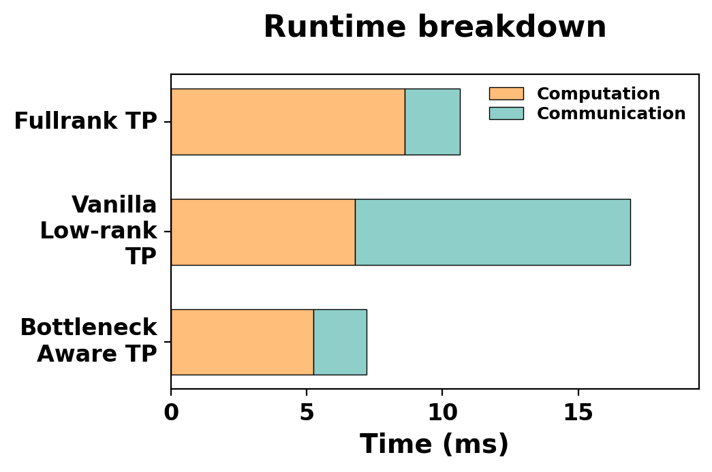

# BOOST: Bottleneck-Optimized Scalable Training Framework For Low-Rank Large Language Models

**BOOST** is a Nanotron-based research framework for scalable training of **low-rank bottleneck LLM**s. It implements **Bottleneck-aware Tensor Parallelism (BTP)** along with several system-level optimizations for efficient distributed training.  

## News

- `2026-03-10`: **Code released!**
- `2026-01-26`: 🎉 BOOST is accepted to **MLSys 2026**!
- `2025-10-30`: We are excited to announce BOOST, a scalable **3D-parallel training framework** for low-rank bottleneck LLMs, featuring efficient communication and computation optimizations.

## Setup

Use the NGC PyTorch container to keep dependencies consistent and avoid host environment drift.

```bash
# Clone the repository on the host
git clone https://github.com/Arcana-2236/BOOST.git
cd BOOST

# Pull the base container
docker pull nvcr.io/nvidia/pytorch:24.01-py3

# Launch the container and mount the repo
docker run --rm --gpus all \
  -v $(pwd):/workspace/BOOST \
  --entrypoint=/bin/bash \
  --shm-size=1g \
  -it nvcr.io/nvidia/pytorch:24.01-py3

# Env setup, Inside the container
cd /workspace/BOOST
pip install datasets transformers
pip install triton "flash-attn==2.5.1.post1" --no-build-isolation
pip install -e .
```

## Quickstart

### 1) Full-rank baseline

```bash
CUDA_DEVICE_MAX_CONNECTIONS=1 torchrun --nproc_per_node=4 run_train.py --config-file examples/config_tiny_llama.yaml
```

### 2) CoLA-BTP run

```bash
CUDA_DEVICE_MAX_CONNECTIONS=1 torchrun --nproc_per_node=4 examples/cola/train_cola.py --config-file examples/cola/config_tiny_cola_llama.yaml
```

## Motivation

<p align="center">
  
  
</p>
<p align="center"><em>Low-Rank Bottleneck Architecture and Iter time in TP setting</em></p>

Low-rank bottleneck architectures decompose dense projections into low-rank factors, reducing parameter count and computational cost while largely preserving model quality. However, when scaling such architectures to multi-GPU systems, **naïvely applying standard Tensor Parallelism (TP)** introduces new inefficiencies.

First, the deeper structure of low-rank layers can introduce **additional communication synchronization points**, increasing communication overhead. Second, the **irregular placement of low-rank factors** often leads to inefficient kernel execution and fragmented computation, which reduces hardware utilization. As a result, the theoretical FLOP reduction from low-rank decomposition may not translate into real training speedups.

This repository focuses on optimizing **Tensor Parallel implementations for low-rank bottleneck LLMs**. In particular, we study how TP design affects **throughput and scalability on multi-GPU and multi-node systems**, and propose optimizations that reduce **communication overhead** and mitigate **kernel-level performance bottlenecks**.

## Methodology

### CoLA Variants in This Repo

1. `BasicCoLA` (reference implementation)
  - Entrypoint: `examples/cola/train_basic_cola.py`
  - Model: `examples/cola/basic_cola_llama.py`
2. `VanillaCoLA` (standard TP decomposition)
  - Entrypoint: `examples/cola/train_vanilla_cola.py`
  - Model: `examples/cola/vanilla_cola_llama.py`
3. `CoLA-BTP` (grouped/batched TP kernels)
  - Entrypoint: `examples/cola/train_cola.py`
  - Model: `examples/cola/cola_llama.py`

### Validation & Debugging Workflow

- Parity and comparison tests: `tests/boost/`
- Paired TP debug script: `run_cola_tp_pair_debug.sh`
- Optional profiling: `nsys profile ...`

### Experiment Protocol (Template)

- Model/config:
- Dataset/token budget:
- Parallelism (`DP/TP/PP/EP`):
- Precision:
- Hardware:
- Metrics tracked:

## Results

`TODO`: Replace this template with measured values.


| Experiment         | Model    | DP/TP/PP/EP | Tokens | Throughput | Loss | Notes |
| ------------------ | -------- | ----------- | ------ | ---------- | ---- | ----- |
| Baseline full-rank | Llama-1B |             |        |            |      |       |
| BasicCoLA          | Llama-1B |             |        |            |      |       |
| VanillaCoLA        | Llama-1B |             |        |            |      |       |
| CoLA-BTP           | Llama-1B |             |        |            |      |       |


## Citation & Acknowledgement

### Citation

`TODO`: Add your paper/preprint citation.

```bibtex
@misc{boost_cola_nanotron,
  title={BOOST: CoLA and Tensor Parallel Training on Nanotron},
  author={TODO},
  year={2026},
  howpublished={\url{https://github.com/Arcana-2236/nanotron}}
}
```

### Acknowledgement

This project builds on the Nanotron ecosystem and open-source LLM training work from the broader community, including Hugging Face Nanotron, NVIDIA Megatron-LM/Apex, DeepSpeed, and FlashAttention contributors.
