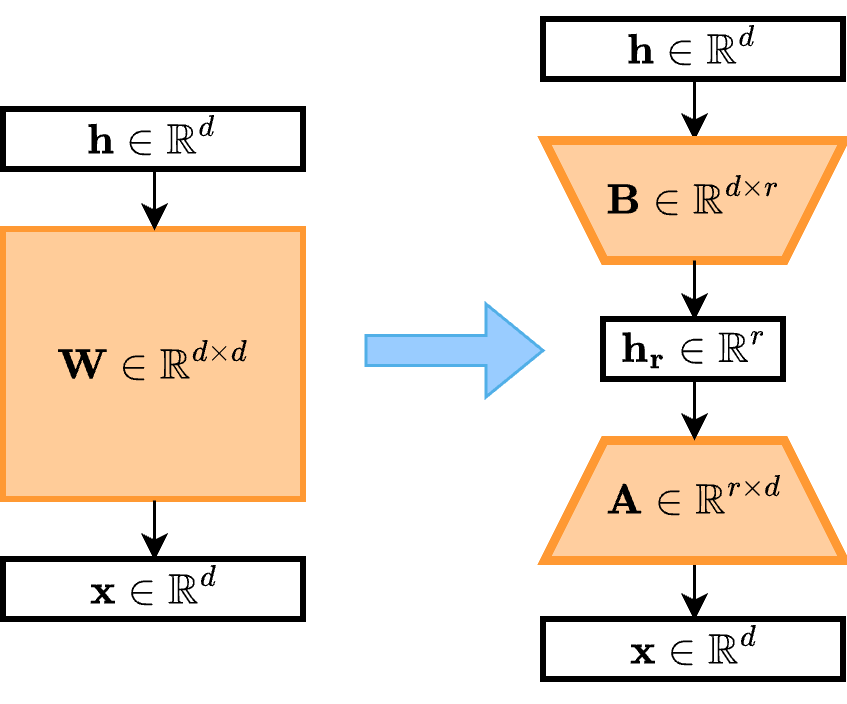
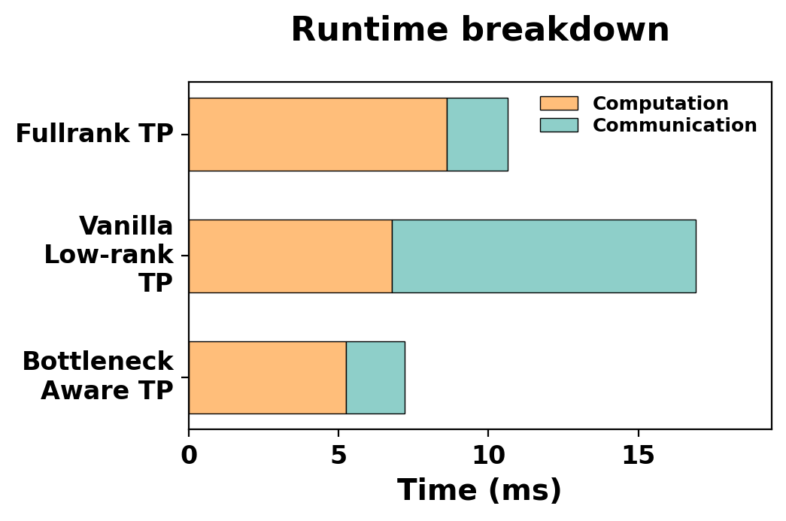
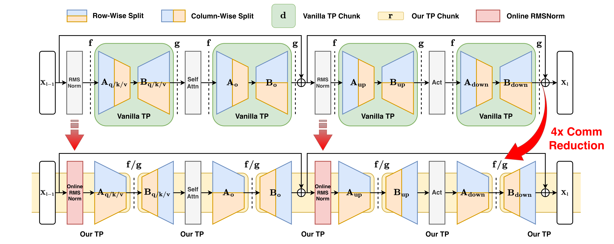

# BOOST: Bottleneck-Optimized Scalable Training Framework For Low-Rank Large Language Models

**BOOST** is a Nanotron-based research framework for scalable training of **low-rank bottleneck LLM**s. It implements **Bottleneck-aware Tensor Parallelism (BTP)** along with several system-level optimizations for efficient distributed training.  

## News

- `2026-03-10`: **Code released!**
- `2026-01-26`: 🎉 BOOST is accepted to **MLSys 2026**!
- `2025-10-30`: We are excited to announce BOOST, a scalable **3D-parallel training framework** for low-rank bottleneck LLMs, featuring efficient communication and computation optimizations.

## Setup

We provide two setup options.

Option 1: NGC container.

```bash
# Clone the repository on the host
git clone https://github.com/Arcana-2236/BOOST.git
cd BOOST

# Pull the base container
docker pull nvcr.io/nvidia/pytorch:24.01-py3

# Launch the container and mount the repo
docker run --rm --gpus all \
  -v $(pwd):/workspace/BOOST \
  --entrypoint=/bin/bash \
  --shm-size=1g \
  -it nvcr.io/nvidia/pytorch:24.01-py3

# Env setup, Inside the container
cd /workspace/BOOST
pip install datasets transformers
pip install triton "flash-attn==2.7.4.post1" --no-build-isolation
pip install -e .
```

Option 2: Conda environment.
We also provide a conda-based setup for local or cluster environments. Our validated software stack uses Python 3.10, PyTorch 2.5.1+cu121, and transformers==4.56.1.

```bash
# Clone the repository on the host
git clone https://github.com/Arcana-2236/BOOST.git
cd BOOST

# Create and activate the conda env
conda create -y -n boost python=3.10 pip
conda activate boost

# Env setup
python -m pip install -U pip setuptools wheel
python -m pip install -r requirements.txt
python -m pip install --no-build-isolation --no-cache-dir "flash-attn==2.7.4.post1"
```

## Quickstart

### 1) Full-rank baseline

```bash
CUDA_DEVICE_MAX_CONNECTIONS=1 torchrun --nproc_per_node=4 run_train.py --config-file examples/config_tiny_llama.yaml
```

### 2) CoLA-BTP run

```bash
CUDA_DEVICE_MAX_CONNECTIONS=1 torchrun --nproc_per_node=4 examples/cola/train_cola.py --config-file examples/cola/config_tiny_cola_llama.yaml
```

### 3) CoLA-VanillaTP run

```bash
CUDA_DEVICE_MAX_CONNECTIONS=1 torchrun --nproc_per_node=4 examples/cola/train_vanilla_cola.py --config-file examples/cola/config_tiny_cola_llama.yaml
```

## Motivation

<p align="center">
  
  
</p>
<p align="center"><em>Low-Rank Bottleneck Architecture and Iter time in TP setting</em></p>

Low-rank bottleneck architectures decompose dense projections into low-rank factors, reducing parameter count and computational cost while largely preserving model quality. However, when scaling such architectures to multi-GPU systems, **naïvely applying standard Tensor Parallelism (TP)** introduces new inefficiencies.

First, the deeper structure of low-rank layers can introduce **additional communication synchronization points**, increasing communication overhead. Second, the **irregular placement of low-rank factors** often leads to inefficient computation kernel execution, which reduces hardware utilization. As a result, the theoretical FLOP reduction from low-rank model training may not translate into real training speedups.

This repository focuses on optimizing **Tensor Parallel implementations for low-rank bottleneck LLMs**. In particular, we study how TP design affects **throughput and scalability on multi-GPU and multi-node systems**, and propose optimizations that reduce **communication overhead** and mitigate **kernel-level performance bottlenecks**.

## Methodology

<p align="center">
  
</p>
<p align="center"><em>Bottleneck-aware Tensor Parallelism Design</em></p>


**BOOST proposes Bottleneck-aware Tensor Parallelism, which:**

- **shifts TP chunk boundaries** to align with the bottleneck structure
- **shards along the large hidden dimension d** instead of the low-rank dimension r --> Improves **GEMM arithmetic intensity** and **GPU utilization**
- performs communication on **low-rank activations [b,s,r]** rather than full hidden states [b,s,d] --> Reduces communication volume

In addition, BOOST introduces several system-level optimizations to further improve training efficiency, including:

- Online RMSNorm to eliminate latency-dominated normalization collectives
- Low-rank linear layer grouping to increase kernel efficiency and reduce launches overhead
- Communication-free low-rank activation checkpointing to reduce memory overhead without introducing additional communication

Together, these techniques enable efficient and scalable distributed training of low-rank bottleneck LLMs.

## Results and Reproduce Procedure

### Configuration Guide

Each experiment script is paired with a YAML configuration file that specifies the model scale, parallelism setting, and optimization flags. In practice, reproducing a paper result mainly requires selecting the corresponding model size and parallelism degree, and enabling or disabling the relevant BOOST-specific optimizations.

The main experiment settings are controlled through YAML config files. The most important parameters used in the reported experiments are summarized below.


| Parameter                        | Description                                                                | Example                                              |
| -------------------------------- | -------------------------------------------------------------------------- | ---------------------------------------------------- |
| `TP strategy`                    | Tensor parallel strategy used in the experiment (FullRank / Vanilla / BTP) | Determined by the launch script under `examples/`    |
| `model_size`                     | Model size used in the experiment                                          | Determined by the YAML config file under `examples/` |
| `model_config`                   | Detailed model architecture configuration                                  | `hidden_size: 4096`                                  |
| `tp_size`                        | Tensor parallel degree                                                     | `4`                                                  |
| `pp_size`                        | Pipeline parallel degree                                                   | `1`                                                  |
| `sequence_length`                | Training sequence length                                                   | `4096`                                               |
| `micro_batch_size`               | Per-GPU micro-batch size                                                   | `4`                                                  |
| `batch_accumulation_per_replica` | Gradient accumulation steps per replica                                    | `1`                                                  |
| `attn_rank`                      | Bottleneck / low-rank dimension for attention projections                  | Usually `hidden_size / 4`                            |
| `mlp_rank`                       | Bottleneck / low-rank dimension for MLP projections                        | Usually `hidden_size / 4`                            |
| `rmsnorm_type`                   | RMSNorm implementation used in the experiment                              | `triton`, `sync`, or `online`                        |
| `recompute_layer`                | Whether activation checkpointing is enabled                                | `false`                                              |


In general:

- **FullRank baseline** uses the standard full-rank model configuration.
- **Vanilla low-rank TP** enables the low-rank architecture without BTP.
- **BOOST / BTP** enables the low-rank architecture together with Bottleneck-aware Tensor Parallelism and other BOOST optimizations as needed.

### End to end System Performance (Fig. 5)

```bash
bash ./run_iter_compare.sh
```


| Model | GPUs | TP  | PP  | FullRank (s) | Vanilla TP (s) | BOOST (s) | Speedup vs FullRank | Speedup vs Vanilla |
| ----- | ---- | --- | --- | ------------ | -------------- | --------- | ------------------- | ------------------ |
| 1B    | 1    | 1   | 1   | 0.85         | 0.56           | 0.59      | 1.44×               | 0.95×              |
| 3B    | 2    | 2   | 1   | 1.14         | 1.41           | 0.78      | 1.46×               | **1.81×**          |
| 7B    | 4    | 4   | 1   | 1.06         | 1.64           | 0.72      | 1.47×               | **2.28×**          |
| 13B   | 8    | 4   | 2   | 2.07         | 2.42           | 1.30      | 1.59×               | **1.86×**          |


### Loss Curve

<p align="center">
  
</p>
<p align="center"></p>

We use the C4 dataset and the LLaMA-2 tokenizer for preprocessing. The detailed hyperparameter settings can be found in train_btp_cola_tiny_debug_polaris.sh.

### Ablation study

#### GEMM Kernel Efficiency (LLaMA-7B, Batch Size = 4) (Fig. 6)

```bash
python3 benchmarking/computation/comp_efficiency.py
```


| Method     | Attn HFU (%) | MLP HFU (%) | Attn GEMM Time (ms) | MLP GEMM Time (ms) |
| ---------- | ------------ | ----------- | ------------------- | ------------------ |
| Vanilla-TP | ~59          | ~59         | ~0.20               | ~0.90              |
| **BTP**    | **~70**      | **~75**     | **~0.16**           | **~0.50**          |


#### Communication Efficiency (LLaMA-7B, Batch Size = 4, Seq Length = 4096) (Fig. 7)

```bash
torchrun --nproc_per_node=4 benchmarking/communication/communication_eff.py
```


| Method      | Communication Volume (GB) | Communication Time (ms) | Reduction vs Vanilla |
| ----------- | ------------------------- | ----------------------- | -------------------- |
| FullRank-TP | ~0.25                     | ~2.01                   | –                    |
| Vanilla-TP  | ~1.32                     | ~9.87                   | 1.0×                 |
| **BTP**     | **~0.22**                 | **~1.85**               | **5.3× faster**      |

#### RMSNorm Type (LLaMA-7B, Seq Length = 4096) (Fig. 7)
```bash
torchrun --nproc_per_node=4 benchmarking/computation/rmsnorm_eff.py
```

| Batch | SyncRMSNorm (ms) | OnlineRMSNorm (ms) | Speedup (Sync/Online) |
| ----- | ---------------- | ------------------ | --------------------- |
| 1     | 0.3754           | 0.1446             | 2.595×                |
| 4     | 0.5417           | 0.5226             | 1.037×                |


#### Grouping Methods (LLaMA-7B, Batch Size = 1, Seq Length = 4096) (Tab. 2)

```bash
python3 benchmarking/computation/grouping_comp_eff.py
torchrun --nproc_per_node=4 benchmarking/communication/grouping_comm_eff.py
```


| Block / Kernel  | Non Grouped Time (us) | Grouped Time (us) | Speedup |
| --------------- | --------------------- | ----------------- | ------- |
| MLP1 Comp       | 355                   | 292               | 1.22×   |
| MLP1 Comm       | 266                   | 218               | 1.22×   |
| QKV Comp        | 391                   | 255               | 1.53×   |
| QKV Comm        | 406                   | 288               | 1.41×   |
| Layerwise Total | 2773                  | 2395              | 1.16×   |


### Notes on Runtime Variance

The reported results were validated in our target environment on A100 80GB GPUs (micro batch size = 4, seqlen = 4096). Absolute runtime and speedup magnitude may vary across hardware and software environments, although the overall performance trend should remain consistent.

In particular, we observed that experiments on A100 40GB GPUs may show smaller end-to-end speedups than those reported in the paper. A main reason is that the reduced memory budget often requires using a smaller micro-batch size (e.g., batch size = 1 instead of 4). Under these settings, GPU kernels are generally less efficient, hardware utilization is lower, and kernel launch overhead becomes a larger fraction of the total runtime.

This effect is especially noticeable for low-rank bottleneck architectures, which are deeper and contain more smaller kernel invocations than the corresponding full-rank baseline. As a result, with smaller batch sizes on 40GB GPUs, the relative speedup of BOOST may decrease even though the same qualitative ordering among FullRank, Vanilla low-rank TP, and BTP is preserved.

We therefore recommend using the pinned software environment and the target hardware configuration described in this README when reproducing the reported numbers as closely as possible.

To help readers compare against our validated environment, we also provide the reference logging results collected on our machine under the `./logging` directory.

## Citation & Acknowledgement

```bibtex
@article{wang2025boost,
  title={BOOST: BOttleneck-Optimized Scalable Training Framework for Low-Rank Large Language Models},
  author={Wang, Zhengyang and Liu, Ziyue and Zhang, Ruijie and Maurya, Avinash and Hovland, Paul and Nicolae, Bogdan and Cappello, Franck and Zhang, Zheng},
  journal={arXiv preprint arXiv:2512.12131},
  year={2025}
}
```

### Acknowledgement

This project builds on the Nanotron ecosystem and open-source LLM training work from the broader community, including Hugging Face Nanotron, NVIDIA Megatron-LM/Apex, and FlashAttention contributors.